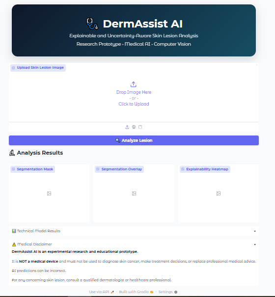
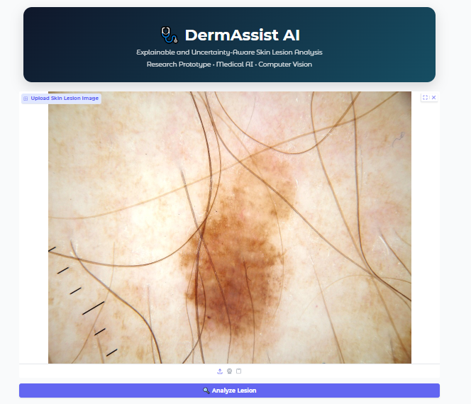
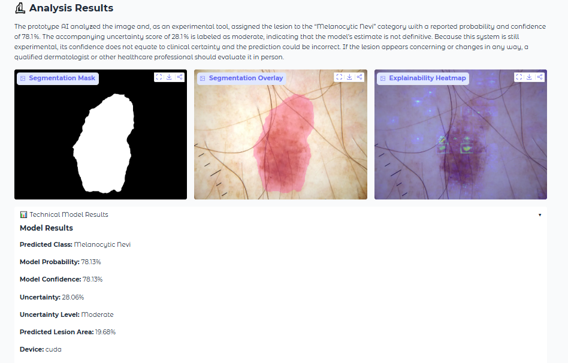

# 🩺 DermAssist AI

Explainable and Uncertainty-Aware Skin Lesion Analysis.

An experimental research and educational prototype combining:
- SegFormer-based lesion segmentation
- ViT-based skin lesion classification
- Predictive-entropy uncertainty estimation
- Gradient-based explainability
- Groq-generated explanation
- Gradio web interface

## Models

Segmentation:
`mahnoor-2722/isic-segformer`

Classification:
`medicaldataset/Skin_Cancer-Image_Classification`

Groq model:
`openai/gpt-oss-120b`

## Hugging Face deployment

Add a Space Secret named:

`GROQ_API_KEY`

Never put the API key directly in `app.py`.

## Methodological note

The displayed uncertainty is normalized predictive entropy, not calibrated
clinical uncertainty. The heatmap is a gradient-based input saliency map and
is not a clinically validated localization method.

Model probability is not clinical cancer risk.

## Medical disclaimer

DermAssist AI is an experimental research and educational prototype. It is
NOT a medical device and must not be used to diagnose skin cancer, make
treatment decisions, or replace professional medical advice.

If you are concerned about a skin lesion, consult a qualified healthcare
professional.

## Local run

```bash
pip install -r requirements.txt
python app.py
```

Set `GROQ_API_KEY` as an environment variable before running locally.
# Demo
## Main Interface


## Input Image


## Segmentation mask


## Segmentation overlay


## Technical Results


## Future research upgrades

- Monte Carlo Dropout
- Deep ensembles
- Temperature scaling
- Expected Calibration Error (ECE)
- Reliability diagrams
- Test-time augmentation
- Dice / IoU evaluation
- ROC-AUC / F1 evaluation
- External validation
- Transformer-specific attribution
- Reproducibility and model cards
- 
